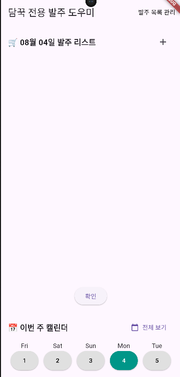
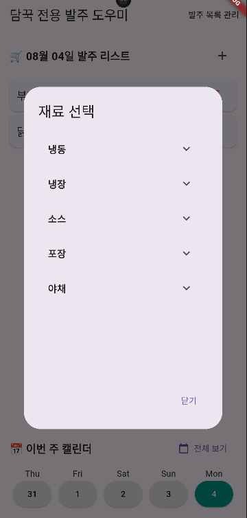
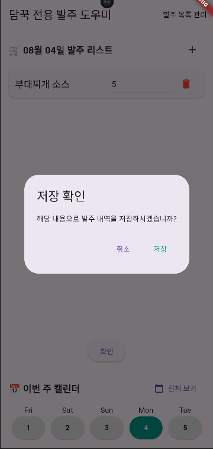
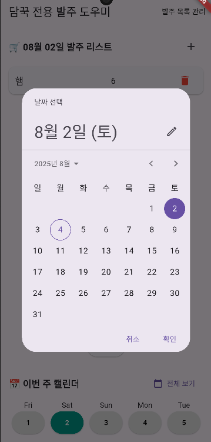

# 담꾹 Flutter 발주 도우미 앱

이 앱은 Flutter로 개발된 **간편한 발주 관리 도우미** 앱으로,  
요식업에 종사하시는 저희 어머니와 동료 점주분들을 위해 직접 제작했습니다 😊  
매일의 재료 발주, 일정 확인, 재고 관리 등을 **한눈에 확인하고 간단히 입력**할 수 있도록 구성되어 있습니다.

📄 [🇯🇵 日本語版READMEはこちら](./README.ja.md)

**사용해보기**(안드로이드용)
- https://appdistribution.firebase.dev/i/10fa5d23488733b7

---

## 주요 기능

### 로그인 & 회원가입 화면
- 회원가입으로 supabase에 계정 정보를 저장합니다.
- 비밀번호는 RPC 방식으로 DB 내부에서 안전하게 암호화·검증되며, 클라이언트는 결과만 받아 보안을 강화했습니다.
- 로그인 후 홈 화면으로 넘어갑니다.

### 홈 화면
- 오늘의 발주 리스트를 카드 형식으로 보여줍니다.
- +버튼을 누르면 미리 등록한 재료들을 선택하여 발주 카드에 추가할 수 있습니다.
- 발주 수량을 입력하고 확인 버튼을 누르면 DB에 저장됩니다.

### 발주 재료 관리
- "발주 목록 관리" 버튼을 통해 등록된 재료를 추가하거나 삭제할 수 있습니다.
- AlertDialog로 삭제 확인을 받으며, UI는 깔끔한 카드 형태로 구성되어 있습니다.
- 확인 버튼을 누르면 날짜와 함께 발주 목록이 DB에 저장됩니다.

### 5일간의 미니 캘린더 + 전체 달력 (팝업)
- 오늘 날짜 기준으로 -3일~+1일까지의 5일간 발주 내역을 쉽게 볼 수 있습니다.
  - 발주 습관과 의견을 여쭤보니 오늘 기준 2~3일 전 발주 내역을 많이 참고하신다고 해 반영했습니다.
- 확인 버튼을 누르면 입력된 수량이 해당 날짜로 DB에 저장되고, 기존 내용은 덮어쓰기됩니다.
- 수량은 저장 후에도 수정 가능하며, 다시 확인 버튼을 누르면 수정된 내용이 반영됩니다.
- "전체보기" 버튼을 누르면 한 달치 달력이 팝업으로 표시되어 원하는 날짜를 선택할 수 있습니다.
- 선택한 해당 날짜를 기준으로 5일치 캘린더가 홈 화면에 표시됩니다.

---

## 사용 기술

- **Flutter**
- **Supabase** (PostgreSQL 기반 백엔드, 실시간 저장 및 조회)
- `intl` 패키지를 이용한 날짜 포맷 처리
- AlertDialog, ListView, TextField 등 다양한 Flutter 위젯 활용

---

## 사용 목적

이 프로젝트는 실제 업무에 도움이 되기 위해 만든 **실제 활용 목적 앱**입니다.  
복잡한 기능보다는 직관적인 UI와 쉬운 조작에 중점을 두었습니다.  
Flutter와 Supabase를 처음부터 함께 익히며, 전반적인 풀스택 앱 개발 경험을 쌓고자 했습니다.

---

## 만든 사람

- 이름: 박정원
- 역할: 앱 전체 기획, 설계, 개발
- 개발 기간: 2025.05.22 ~ 2025.06

